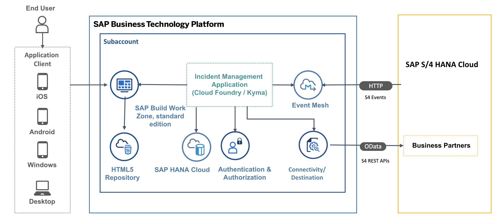

# BTP Developer's Guide

## Overview

The goal of the SAP BTP Developer’s Guide is to help developers implementing business applications on SAP BTP including the integration with the SAP cloud suite. It consists of the description of the software development and delivery processes, an architecture blueprint with a curated list of services implementing the standard nucleus of SAP’s business applications on SAP BTP, and instructions to deliver SAP Cloud Qualities and Intelligent Enterprise Suite Qualities. The tutorials built using Incident Management application follows the best practices and guidance described in SAP BTP developers guide.

## Business Scenario

The Incident Management application uses the following sample business scenario:

ACME is a popular Electronics company. ACME hires call center support representatives to process and manage customer incidents. A call center support representative (Processor) receives a phone call from an existing customer and creates a new incident on behalf of the customer. The newly created incident is based on a customer complaint received during the phone call so the call center support representative also adds the conversation with the customer to the incident.

## Solution Diagram

## Entitlements

The application requires the following set of [Entitlements and Quotas](https://help.sap.com/products/BTP/65de2977205c403bbc107264b8eccf4b/00aa2c23479d42568b18882b1ca90d79.html?locale=en-US) in the SAP BTP cockpit:

### Deployment on CF

| Service                           | Plan               | Number of Instances |
|-----------------------------------|------------------- |:-------------------:|
| SAP HANA Schemas & HDI Containers | hdi-shared         |          1          |
| SAP HANA Cloud                    | tools              |  Subscription       |
| SAP HANA Cloud                    | hana               |          1          |
| Cloud Foundry Runtime                      |   MEMORY                 |          1          |
| SAP Build Work Zone, standard edition             | standard/free      |  Subscription       |

### Deployment on Kyma

| Service                           | Plan               | Number of Instances |
|-----------------------------------|------------------- |:-------------------:|
| SAP HANA Schemas & HDI Containers | hdi-shared         |          1          |
| SAP HANA Cloud                    | tools              |  Subscription       |
| SAP HANA Cloud                    | hana               |          1          |
| Kyma runtime                      |                    |          1          |
| SAP Build Work Zone, standard edition              | standard/free      |  Subscription       |

## Tutorials

Best practices are documented in a step-by-step tutorial/guide for learning how to develop, deploy and operate a full stack application using SAP Cloud Application Programming Model and SAP Fiori. 

The tutorial also describes how to use a set of most important BTP services in a CAP application. A reference implementation is provided based on “Incidents management “ example as part of the tutorial to provide hands-on experience. 

Best practices are documented in a step-by-step tutorial/guide for learning how to develop, deploy and operate a full stack application using SAP Cloud Application Programming Model and SAP Fiori. 

The tutorials built using the Incident Management application are organized in two parts: 

- Beginner tutorials 
- Advanced modules 

The beginner tutorials cover the following basic steps for Cloud Foundry and Kyma runtimes: 

- Setting up the development environment 
- Building a CAP application with SAP Fiori elements user interface and a custom logic 
- Adding local launchpad, authorization and tests for local development  
- Deploying the application in a productive account  
- Setting up continuous integration and delivery pipeline   

The advanced modules are built on top of the beginner tutorials. Depending on what you need, you can pick the different modules. For each of these modules, the beginner tutorials is a prerequisite. The modules are: 

- Integrating Change tracking to Incident Management Application
- Remote service integration using the SAP Destination and SAP Connectivity service 
- Eventing using the SAP Event Mesh service which is built on top of Remote Service sample
- Audit logging using SAP Audit Log service 

## Known Issues

No known issues.

## How to Obtain Support

In case you find a bug, or you need additional support, please open an issue here in GitHub.

## License
Copyright (c) 2022 SAP SE or an SAP affiliate company. All rights reserved. This project is licensed under the Apache Software License, version 2.0 except as noted otherwise in the [LICENSE](LICENSE) file.
