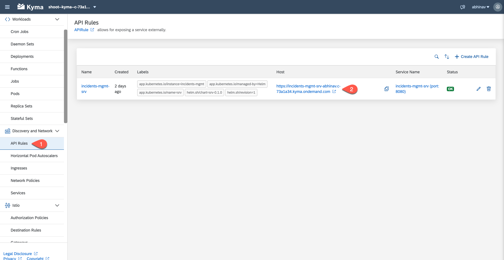
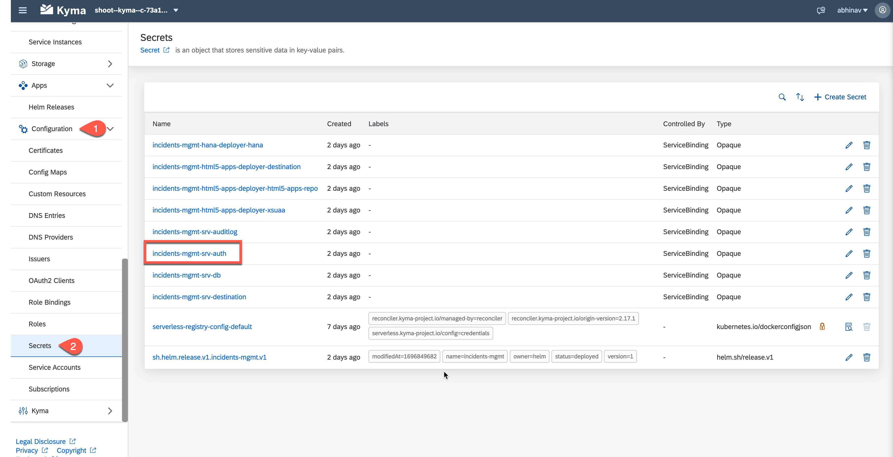
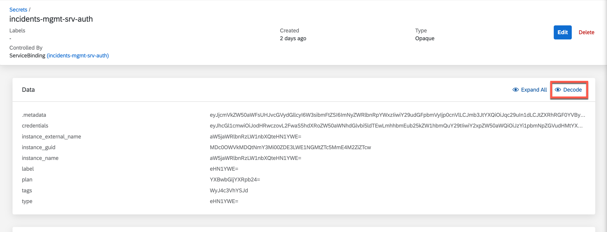
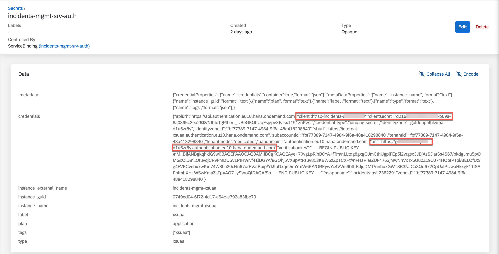
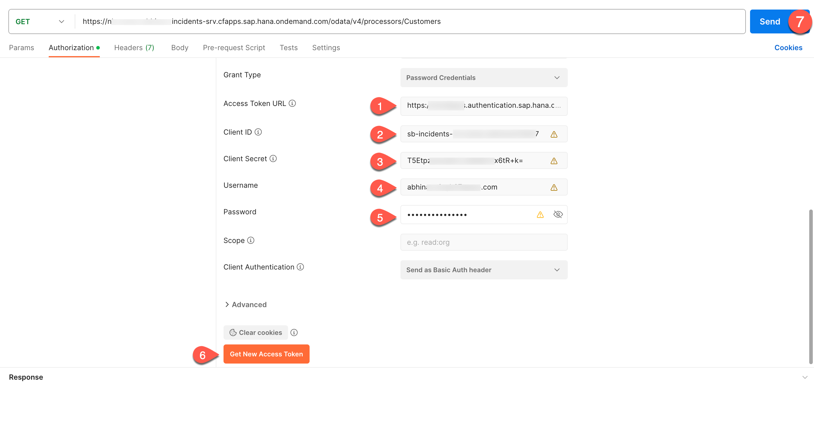

# Option 2 - Deploy and Run the Application on Kyma

## Build the Images

We recommend using [Cloud Native Buildpacks](https://buildpacks.io/) to transform source code (or artifacts) into container images. For local development scenarios, you can use the [pack](https://buildpacks.io/docs/tools/pack/) CLI to consume Cloud Native Buildpacks. Check out [About Cloud Native Buildpacks](https://cap.cloud.sap/docs/guides/deployment/deploy-to-kyma?impl-variant=node#about-cloud-native-buildpacks) for more info.

Log in to your container registry:

```sh
docker login docker.io -u <your-user>

```
**Before you begin**

Please note the following points:

If you're using any device with a non-x86 processor (e.g. MacBook M1/M2) you need to instruct the Docker to use x86 images by setting the [DOCKER_DEFAULT_PLATFORM](https://docs.docker.com/engine/reference/commandline/cli/#environment-variables) environment variable.
export DOCKER_DEFAULT_PLATFORM=linux/amd64

1. Do the productive build for your application, which writes into the `gen` folder:

```sh
cds build --production
```

2. Build the `srv` image:

```sh
pack build <your-container-registry>/incident-management-srv:<image-version> \
     --path gen/srv \
     --builder paketobuildpacks/builder-jammy-base \
     --publish
```

3. Build the database image:

```sh
pack build <your-container-registry>/incident-management-hana-deployer:<image-version> \
     --path gen/db \
     --builder paketobuildpacks/builder-jammy-base \
     --publish
```

4. Build the HTML5 Deployer image

```sh
pack build <your-container-registry>/incident-management-html5-deployer:<image-version> \
     --path app/incidents \
     --builder paketobuildpacks/builder-jammy-base \
     --publish
```

5. Add your container image settings to your `chart/values.yaml`:

```yaml{4,7,8,9,13,14,18,19,23,24}
...
global:
  imagePullSecret:
    name: [<image pull secret name>] 
...
srv:
  image:
    repository: <your-container-registry>/incident-management-srv
    tag: <srv-image-version>
...
hana-deployer:
  image:
    repository: <your-container-registry>/incident-management-hana-deployer
    tag: <db-deployer-image-version>
...
html5-apps-deployer:
  image:
    repository: <your-container-registry>/incident-management-html5-deployer
    tag: <html5apps-deployer-image-version>
```
6. Change the value for `SAP_CLOUD_SERVICE` to `incidents`
```yaml{3}
html5-apps-deployer:
  env:
    SAP_CLOUD_SERVICE: incidents
```
7. Add auditlog service configurations to your `charts/values.yaml`:

```
auditlog:
  serviceOfferingName: auditlog
  servicePlanName: premium
```
In `srv/bindings` add:
```
auditlog:
    serviceInstanceName: auditlog
```
8. Navigate to  `chart/Charts.yaml` and update  dependencies section with following code:
```
  - name: service-instance
    alias: auditlog
    version: ">0.0.0"
```
### Configure Cluster Domain

1. Specify the domain of your cluster in the `chart/values.yaml` file so that the URL of your CAP service can be generated:

```yaml
...
domain: <cluster domain>

```
You can use the following command to get the domain name for your Kyma cluster:

```yaml
kubectl get gateway -n kyma-system kyma-gateway \
        -o jsonpath='{.spec.servers[0].hosts[0]}'
```

2. Replace `<your-cluster-domain>` with your cluster domain in the `xsuaa` section of the `values.yaml` file:
```yaml
xsuaa:
  serviceOfferingName: xsuaa
  servicePlanName: application
  parameters:
    xsappname: incident-management
    tenant-mode: dedicated
    oauth2-configuration:
      redirect-uris:
        - https://*.<your-cluster-domain>/**

```
3. Add the destinations under `backendDestinations` in the `values.yaml` file:

```yaml
backendDestinations:
  incident-management-srv-api:
    service: srv
```
::: info
`backend` is the name of the destination. `service` points to the deployment name whose URL will be used for this destination.
:::


## Deploy CAP Helm Chart to Kyma

1. Log in to your Kyma cluster.

2. Run the below command to create a namespace
```sh
kubectl create namespace incidents-namespace
kubectl label namespace incidents-namespace istio-injection=enabled
```

3. Deploy using Helm command:
```sh
helm upgrade --install incident-management --namespace incidents-namespace ./chart \
--set-file xsuaa.jsonParameters=xs-security.json
```
This installs the Helm chart from the chart folder with the release name ***incident-management*** in the namespace ***incidents-namespace***.

::: tip

With the ***helm upgrade --install*** command you can install a new chart as well as upgrade an existing chart.
:::

## Test your application

1. We will be using API Testing tools like [Postman](https://www.postman.com/) or [Insomnia](https://insomnia.rest/) to test and generate auditlog.
2. You have to [Assign Application Roles](https://developers.sap.com/tutorials/user-role-assignment.html) to be able to access the application via the URL.
3. Go to your Kyma cluster and get the application endpoint from `your-namespace->Discovery and Networks->API Rules->incident-management-srv`.


4. In order to access the below endpoint, the user needs `support` role and `xsuaa token` has to be passed in the header.
5. To generate the token, use the following credentials from your XSUAA Instance: `clientId`, `clientsecret`, `url/oauth/token`.

6. To acess the xsuaa credentials follow the below steps:
  -  Goto your namespace -> Configuration, click on Secrets, and 
  select your XSUAA application.
  <br/> 
  -  Now click on decode to decrypt the Data 
  -  Use the following credentials: `clientId`, `clientsecret`, `url` to generate access token. 

7. Use postman and generate access token. Set authorization type as `OAuth 2.0` , `cf username` ,`cf password` and generate access token.


8. Use `<your application end point>/odata/v4/processor/Customers` and send the request( Step 7 in the above screenshot)  and if successful, you will get the list of customers as response:
```
{
    "@odata.context": "$metadata#Customers",
    "value": [
        {
            "ID": "2b87f6ca-28a2-41d6-8c69-ccf16aa6389d",
            "createdAt": null,
            "createdBy": null,
            "modifiedAt": null,
            "modifiedBy": null,
            "firstName": "Sunny",
            "lastName": "Sunshine",
            "email": "sunny.sunshine@demo.com",
            "phone": "+01-555-789",
            "creditCardNo": null,
            "name": "Sunny Sunshine"
        },
        {
            "ID": "8fc8231b-f6d7-43d1-a7e1-725c8e988d18",
            "createdAt": null,
            "createdBy": null,
            "modifiedAt": null,
            "modifiedBy": null,
            "firstName": "Daniel",
            "lastName": "Watts",
            "email": "daniel.watts@demo.com",
            "phone": "+44-555-123",
            "creditCardNo": null,
            "name": "Daniel Watts"
        },
        {
            "ID": "feb04eac-f84f-4232-bd4f-80a178f24a17",
            "createdAt": null,
            "createdBy": null,
            "modifiedAt": null,
            "modifiedBy": null,
            "firstName": "Stormy",
            "lastName": "Weathers",
            "email": "stormy.weathers@demo.com",
            "phone": null,
            "creditCardNo": null,
            "name": "Stormy Weathers"
        }
    ]
}
```
9. On reading the customer data( which we have annotated with @PersonalData), there will be a audit log entry in CF, which we will be retrieving in next step. 


