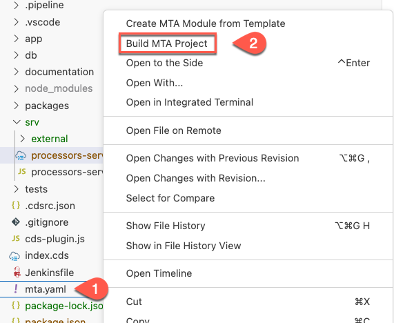

# Deploy and Run the Application on Cloud Foundry with SAP S/4HANA Cloud Backend

## Usage scenario

Deploy the project to Cloud Foundry using the MTA build file

## Prerequisites

* You have prepared the project for productive usage

## Content
Extend the existing MTA build file with the settings for SAP S/4HANA Cloud extension service.


### Deploy the Application

1. Add SAP S/4HANA Cloud API access service. Right-click the mta.yaml file and choose **Open with ... - Text Editor**.
2. Add the following code snippet to the resource section

    ```yaml
    - name: incidents-api-access
        type: org.cloudfoundry.managed-service  
        parameters:
          path: ./bupa.json
          service: s4-hana-cloud
          service-plan: api-access
          system-name: <system-name>
    ```

**Note** - As **system-name** you must enter the name of your the registered SAP S/4HANA Cloud system.

3. Add the below code snippet to mta.yaml resources
    ```yaml
      - name: incidents-destination
        type: org.cloudfoundry.managed-service
        parameters:
          service: destination
          service-plan: lite
    ```

4. In the incidents-mgmt-srv module requires section add **- name: incidents-mgmt-destination-service**
   
    ```yaml
    - name: incidents-mgmt-srv
      type: nodejs
      path: gen/srv
      requires:
      - name: incidents-mgmt-auth
      - name: incidents-mgmt-db
      - name: incidents-mgmt-destination-service
    ....
    ```

5. Right-click the mta.yaml file and choose **Build MTA Project**
   
   

5. If the build was successful, you find the generated file in the mta_archives folder. Right-click on incidents_1.0.0.mtar and select **Deploy MTA Archive**  
   
   

6. Login to your SAP BTP subaccount and space to start the deployment.
   
   

   

You have to [Assign Application Roles](../../../../administrate/User-Role-Assigment/User-Role-Assignment.md) to be able to access the application via the URL.
