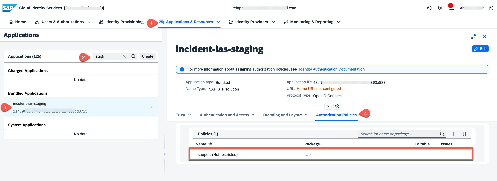
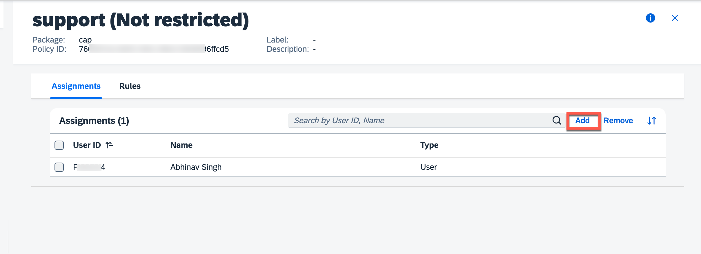

# Deploy and Run the Application on Cloud Foundry

## Prerequisites

Refer to [prerequisite-for-sample](./1-getting-started-with-ams.md) to prepare your sample for deploying to CF.


## Add IAS and AMS

 1. Create ias-config.json file in your project root folder with following content and replace the ```<unique-id>``` with a unique value to uniquely identify your IAS app in IAS Tenant:

    ```json hl_lines="7-9"
        {
          
            "authorization": {
              "enabled":true
            },
            "provided-apis": [
                {
                  "name": "incidents-api",
                  "description": "api exposed by incident mgmt app"
                }
              ],
            "display-name": "incident-ias-<unique-id>"
        }
    ```

2. Check if the following dependencies and configurations have been added to the `package.json`:

    <!-- cpes-file package.json:$.cds.requires -->
    ```json hl_lines="7-9"
    {
        ...
        "dependencies": {
        "@sap/ams": "^1.13.0",
        "@sap/cds": "^7.0",
        "@sap/xssec": "^3.3.5",
        "hdb": "^0.19.0",
        "passport": "^0"
      },
      "devDependencies": {
        "@sap/ams-dev": "^0.7.0",
        "@sap/cds-dk": "^7"
      },
    ```
3. Change the `auth.kind` to `ias` in `package.json` for the production profile:
    ```json    
        ...
      "cds": {
        "requires": {
          "[production]": {
            ...
            "auth": {
              "kind": "ias"
            }
          }
        }
        }
    }
    ```
## Deploy to Cloud Foundry

1. Update `mta.yaml` with the following content

- Change the dependency `incident-management-auth ` in `resources` from `xsuaa` service instance:
     ```yaml
     - name: incident-management-auth
       type: org.cloudfoundry.managed-service
       parameters:
         config:
           tenant-mode: dedicated
           xsappname: incidents-${org}-${space}
         path: ./xs-security.json
         service: xsuaa
         service-plan: application
     ```
 
- To `ias` service instance:
     ```yaml
       - name: incident-management-auth
         parameters:
            path: ./ias-config.json
            service-plan: application
            service: identity
         type: org.cloudfoundry.managed-service
     ```


  
- Add following configurations to `incident-management-srv` module

    - Change `incident-management-auth` service binding with `incident-management-srv` to: 
      ```yaml
      - name: incidents-management-srv
        type: nodejs
        path: gen/srv
        requires:
        - name: incident-management-auth
          parameters:
            config:
               credential-type: "X509_GENERATED"
      ```
    - Update your buildpacks section by adding `OPA buildpack`
    
      ```yaml
          parameters:
            buildpacks:
             - https://github.com/SAP/cloud-authorization-buildpack/releases/latest/download/opa_buildpack.zip
             - nodejs_buildpack
      ```
      
    - Add `AMS_DCL_ROOT` to `properties` section
    
      ```yaml
        properties:
          AMS_DCL_ROOT: "ams/dcl"
      ```
  - Delete `incident-management-auth` binding from `incident-management-destination-content`
      ```yaml
        - name: incident-management-auth
          parameters:
            service-key:
              name: incident-management-auth-key
      ```
  - Delete `incidents_incident_management_html_repo_host` destination from `incident-management-destination-content`
      ```yaml
              - Authentication: OAuth2UserTokenExchange
                Name: incidents_incident_management_auth
                ServiceKeyName: incident-management-auth-key
                sap.cloud.service: incidents
      ```
  ### Note:
  Kindly check, the module `incident-management-destination-content` in mta.yaml should look like this:
    ```yaml
    - name: incident-management-destination-content
      type: com.sap.application.content
      requires:
        - name: incident-management-destination-service
          parameters:
            content-target: true
        - name: incident-management_html_repo_host
          parameters:
            service-key:
              name: incident-management_html_repo_host-key
        parameters:
          content:
            instance:
              destinations:
              - Name: incidents_incidents_management_html_repo_host
                ServiceInstanceName: incident-management-html5-app-host-service
                ServiceKeyName: incident-management_html_repo_host-key
                sap.cloud.service: incidents
              existing_destinations_policy: ignore
        build-parameters:
          no-source: true
    ```
  - Update `incident-management-srv-api` in `incident-management-destination-service`

    - Add `HTML5.IASDependencyName: incidents-api`
    
      ```yaml hl_lines="5"
          - Authentication: NoAuthentication
            HTML5.IASDependencyName: incidents-api
            Name: incidents-management-srv-api
            ProxyType: Internet
            Type: HTTP
            URL: ~{srv-api/srv-url}
          existing_destinations_policy: update
      ```
  - Update your build-parameters with the following code :
      ```yaml
        build-parameters:
          before-all:
          - builder: custom
            commands:
            - npx -p @sap/cds-dk cds build --production
            - npx -p cpy-cli -- cpy "ams" "./gen/srv"
      ```
2. Update `app/incidents/xs-app.json` with the following code:
   ```json
      {
      "welcomeFile": "/index.html",
      "authenticationMethod": "route",
      "routes": [
        {
          "source": "^/odata/(.*)$",
          "target": "/odata/$1",
          "destination": "incident-management-srv-api",
          "authenticationType": "ias",
          "csrfProtection": false
        },
        {
          "source": "^/resources/(.*)$",
          "target": "/resources/$1",
          "authenticationType": "none",
          "destination": "ui5"
        },
        {
          "source": "^/test-resources/(.*)$",
          "target": "/test-resources/$1",
          "authenticationType": "none",
          "destination": "ui5"
        },
        {
          "source": "^(.*)$",
          "target": "$1",
          "service": "html5-apps-repo-rt",
          "authenticationType": "ias"
        }
      ]
    }
   ```
   > Change the authenticationType of `incident-management-srv-api` and `html5-apps-repo-rt` from `xsuaa` to `ias`
3. Update `app/incidents/webapp/xs-app.json` with the following code:
   ```json
      {
      "authenticationMethod": "route",
      "logout": {
        "logoutEndpoint": "/do/logout"
      },
      "routes": [
        {
          "source": "^(.*)$",
          "target": "$1",
          "service": "html5-apps-repo-rt",
          "authenticationType": "ias"
        }
      ]
    }

   ```
   > Change the authenticationType of `html5-apps-repo-rt` from `xsuaa` to `ias`
4. Update `app/incidents/webapp/manifest.json` with the following code
5. Build the mtar

    ```bash
    mbt build
    ```
    
6. Log in to your SAP BTP Subaccount and choose your CF space where you want to deploy your application

    ```bash
    cf login -a <api-endpoint>
    ```
    
7.  Deploy to Cloud Foundary

    ```bash
    cf deploy mta_archive/<mtar_name>.mtar
    ```

After successful deployment, you can go to your ```BTP Cockpit/Your Subaccount/Your space``` and see your application as well as bound services.

## Check Your IAS Application and Uploaded AMS Policies.

- Log in to your IAS Tenant and goto Applications & Resources
- Search and swlwct your app with `incident-ias-<unique-id>` (In this case its `incident-ias-staging`)
- Check uploaded dcl policies under the Authorization Policies Section.
    <br />
    
- Assign users to your policies.
    <br/>   

## Set Up App2App Communication

The application has [app2app navigation](https://help.sap.com/docs/build-work-zone-standard-edition/sap-build-work-zone-standard-edition/switching-to-sap-cloud-identity-services-identity-authentication#app-to-app-navigation) configuration where the CAP back end with IAS-based authentication exposes an API that is configured as a dependency of the Workzone’s IAS application. The IASDependencyName is then defined in the GACD Destination Deployer module configuration.
### Update OpenID Connect Configuration
  - Log in to your IAS Tenant Admin Console.
  - Go to your Applications & Resources.
  - Search your IAS application bounded to your CAP back end. (In this case its `incident-ias-staging`)
  - Go to `trust` -> `OpenID Connect Configuration` -> `Advance Settings` -> `Access Token Format` and choose `JSON Web Token`
  

### Set up app2app communication

  - Log in to your IAS Tenant Admin Console.
  - Go to your Applications & Resources.
  - Search your IAS application bounded to your CAP back end. (In this case its `incident-ias-staging`)
  - Verify that the end point exposed by your application is listed in `Application APIs -> Provided APIs` section.
   
  - Now, Search and select your Workzone IAS application `SAP Build Work Zone, standard edition` -> Application APIs -> Dependencies, add `Add` a dependency.
   
  - Give a dependency name `same` as you provide in the `destination service configuration property` in mta.yaml
    ```yaml
     HTML5.IASDependencyName: incidents-api
    ```
  - For each application, select the IAS application bounded to your CAP back end.(in this case, its `incident-ias-staging`)
  - Select the exposed end point.(In this case, its `incidents-api`), and `save` it.
    

## Access Your Application
As a next step, proceed to Integrate with [SAP Build Workzone, standard edition](https://developers.sap.com/tutorials/integrate-with-work-zone.html) to access the application in launchpad.

